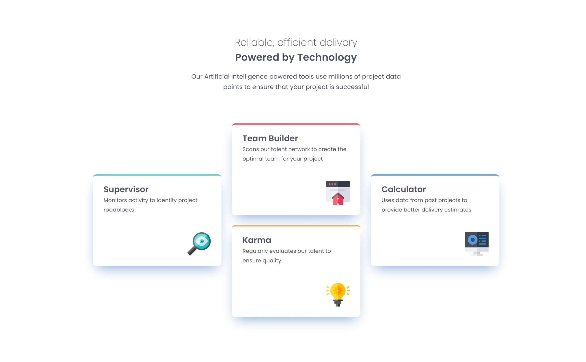
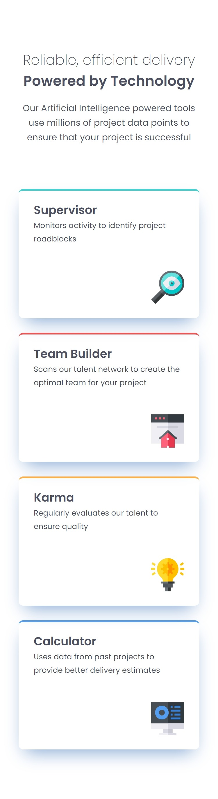

# Four card feature section solution 

## Table of contents

- [Overview](#overview)
  - [The challenge](#the-challenge)
  - [Screenshots](#screenshots)
  - [Links](#links)
- [My process](#my-process)
  - [Built with](#built-with)
  - [What I learned](#what-i-learned)
  - [Continued development](#continued-development)
  - [Useful resources](#useful-resources)
- [Author](#author)

## Overview

### The challenge

Users should be able to:

- View the optimal layout for the site depending on their device's screen size

### Screenshots






### Links

- Solution URL: [Code](https://github.com/rinta-git/FEATURE-DISPLAY-PAGE/blob/main/index.html)
- Live Site URL: [FEATURE-DISPLAY-PAGE](https://rinta-git.github.io/FEATURE-DISPLAY-PAGE/)

## My process

### Built with

- Semantic HTML5 markup
- SCSS
- Flexbox
- CSS Grid
- Mobile-first workflow


### What I learned

I learned how to center an item between two rows, positioning it so that it spans both rows evenly.

see below:


```css
.card0 {
  grid-column: 1 / 2; 
  grid-row: 1 / 3; /* Span from the first to the second row */
  justify-self: flex-end;
}
```

### Useful resources

- [CSS Tricks](https://css-tricks.com/snippets/css/a-guide-to-flexbox/) - This helped me for quickly checking both flexbox and grid proprties and its usage.

## Author

- Website - [Rinta Roy](https://www.linkedin.com/in/rinta-roy)
- Frontend Mentor - [@rinta-git](https://www.frontendmentor.io/profile/rinta-git)
